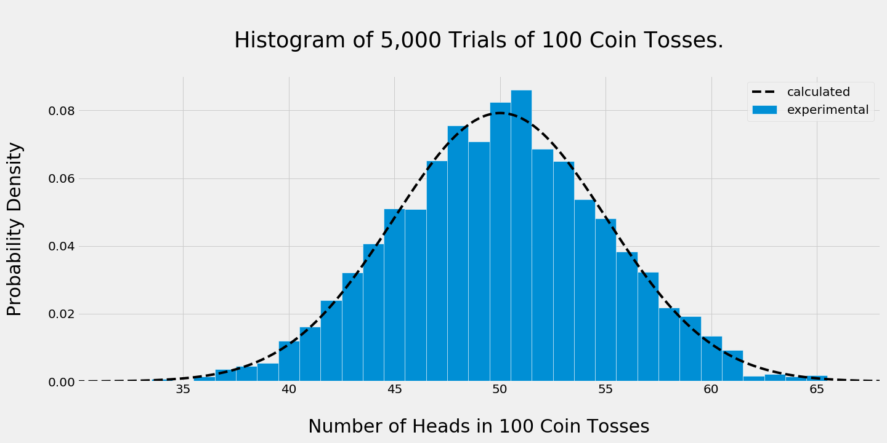

# *coin-toss*

*Coin-toss is the quick and dirty statistcal analysis of simulated trials of tossing a coin repeatedly.* 

## Setup 

### Dependencies

*[matplotlib](https://matplotlib.org)*  
*[numpy](http://www.numpy.org)*  
*[scipy](https://www.scipy.org)*

### Installation

~~~
pip install -r requrements.txt
~~~

### Getting started

*The functions contained within stand alone and require no database.*

## Usage

*By altering the number of coin tosses, repeated trials, and "fairness" of a coin, the statistical probabilities of various outcomes can be explored.*

## Demo

~~~python
n_coin_tosses = 100
m_trials = 5000
trials = simulate_m_trials_of_n_coin_tosses(m=m_trials, n=n_coin_tosses)
plot_histogram_of_trials(trials, m=m_trials, n=n_coin_tosses)
~~~

## Author

* Kevin Vanderveen